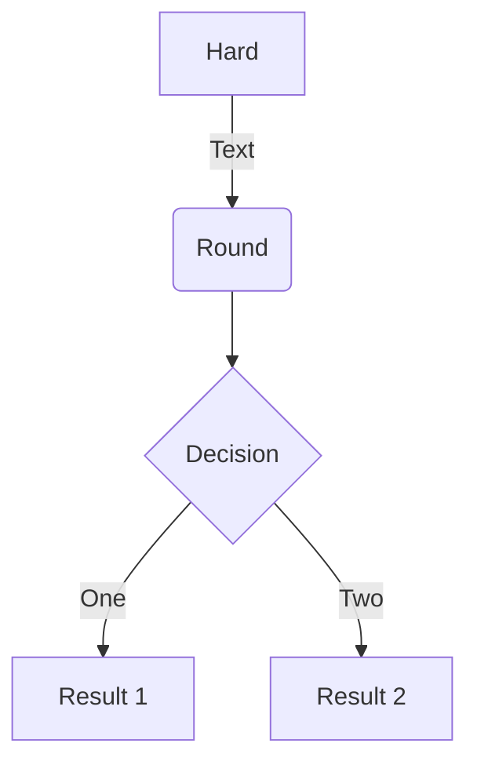
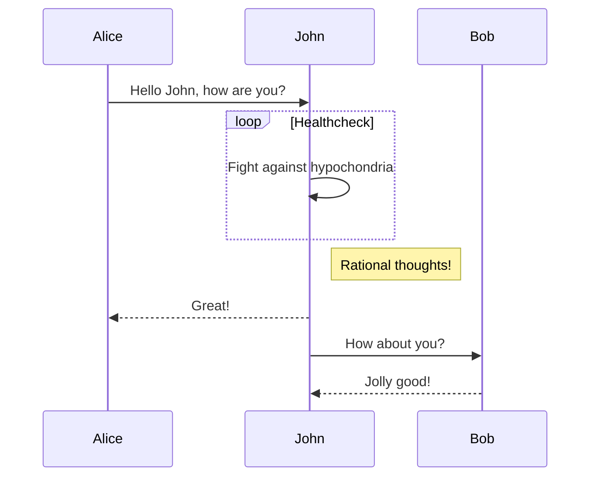
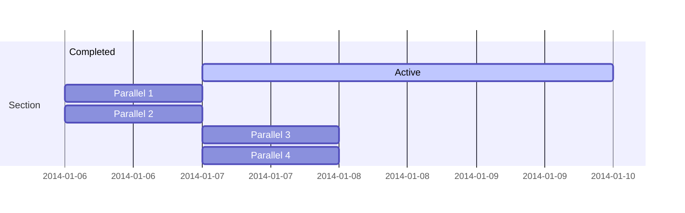
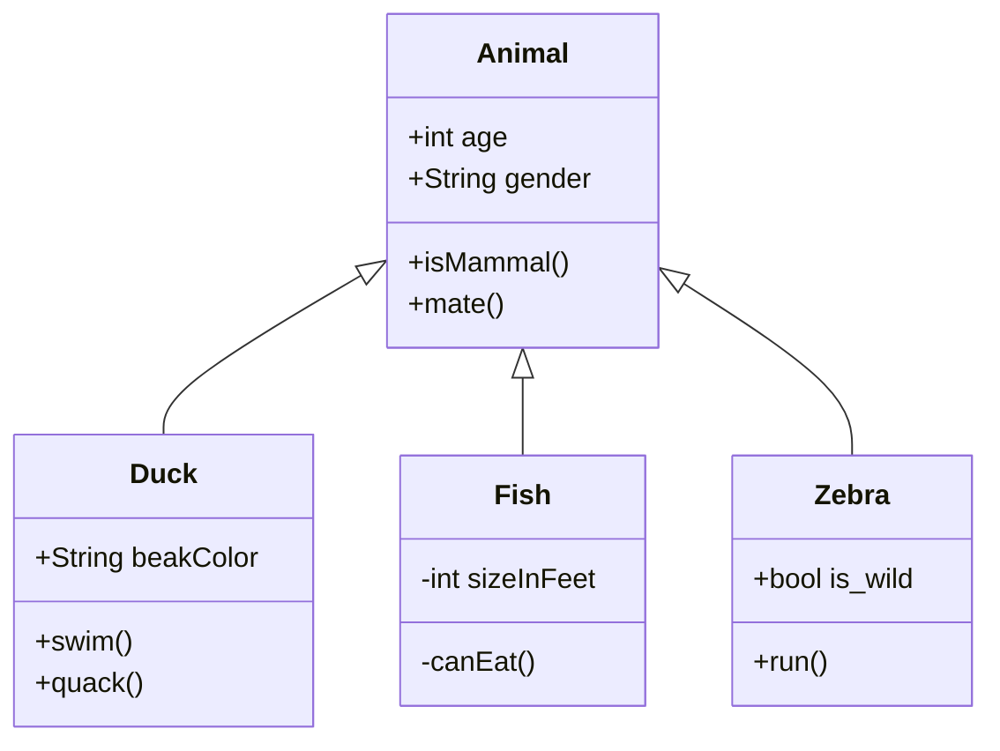
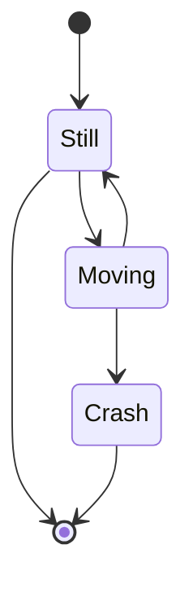
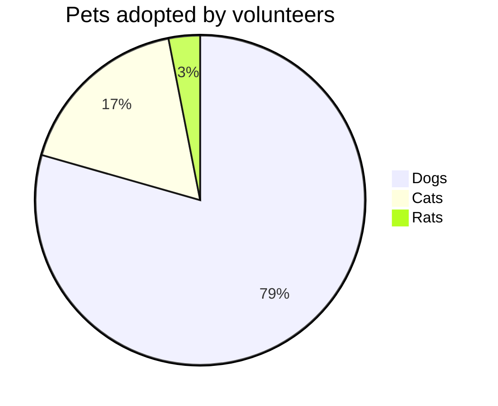

---

title: Yur 主题 MarkDown 展示

meta:
  - name: description
    content: Yur 主题 MarkDown 展示
  - name: keywords
    content: Yur，主题，MarkDown，展示

created: 2019/11/09

updated: 2020/11/10

tags:
  - MarkDown
  - Yur

---

# Yur 主题 MarkDown 展示

## 容块

::: primary
这是 ::: primary
:::

::: primaryLong
这是 ::: primaryLong
:::

::: success
这是 ::: success
:::

::: successLong
这是 ::: successLong
:::

::: tip
这是 ::: tip
:::

::: tipLong
这是 ::: tipLong
:::

::: warning
这是 ::: warning
:::

::: warningLong
这是 ::: warningLong
:::

::: error
这是 ::: error
:::

::: errorLong
这是 ::: errorLong
:::

## 链接

[GitHub](https://github.com/cnguu/vuepress-theme-yur)

[凉风有信](/)

## 表格

| 居左 | 居中 | 居右 |
| :- | :-: | -: |
| 居左 | 居中 | 居右 |
| 居左居左 | 居中居中 | 居右居右 |
| 居左居左居左 | 居中居中居中 | 居右居右居右 |

## Emoji

:tada: :100: :apple:

## 目录

> 切换到手机预览

[[toc]]

## 代码块

```js {1,3}
console.log('VuePress');
console.log('Theme');
console.log('Yur');
```

## 短块

这是`短块`元素

## 引用

> 这是引用 >
>> 引用嵌套
>>> 禁止套娃

## 强调

- **加粗**
- *斜体*
- ***斜体加粗***
- ~~删除线~~

## 小图标

<Icon name="github" />

<Icon name="man" color="#39c5bb" />

<Icon name="woman" size="2em" />

## 数学公式

$\sqrt{3x-1}+(1+x)^2$

$$ f(x) = \int _{-\infty}^\infty \hat f(\xi)\, e^{2 \pi i \xi x} \, d\xi$$

$$
\begin{array}{c}
\nabla \times \vec{\mathbf{B}} -\, \frac1c\, \frac{\partial\vec{\mathbf{E}}}{\partial t} &
= \frac{4\pi}{c}\vec{\mathbf{j}}    \nabla \cdot \vec{\mathbf{E}} & = 4 \pi \rho \\
\nabla \times \vec{\mathbf{E}}\, +\, \frac1c\, \frac{\partial\vec{\mathbf{B}}}{\partial t} & = \vec{\mathbf{0}} \\
\nabla \cdot \vec{\mathbf{B}} & = 0
\end{array}
$$

$$
\partial_t W + m_x[\partial_x(Uw) + \partial_y(Vw)] + \partial_\eta(\Omega w) - m^{-1}_y g [(\alpha / \alpha_d)\partial_\eta p - \mu_d] = F_W
\tag{2.20}
$$

$$ \partial_t \Theta_m + m_x m_y[\partial_x(U\Theta_m) + \partial_y(V\Theta_m)] + m_y\partial_\eta(\Omega\Theta_m) = F_{\Theta_m} \tag{2.21} $$

$$ \partial_t\mu_d + m_x m_y[Ux + Vy] + m_y\partial_\eta(\Omega) = 0 \tag{2.22} $$

$$ \partial_t\phi + \mu^{-1}_d [m_x m_y(U\partial_x\phi + V \partial_y\phi) + m_y\Omega\partial_\eta\phi-m_ygW] = 0 \tag{2.23} $$

$$ \partial_t Q_m + m_x m_y[\partial_x(Uq_m) + \partial_y(Vq_m)] + m_y\partial_\eta(\Omega q_m) = F_{Q_m} \tag{2.24} $$

## 流程图



## 时序图



## 甘特图



## UML



## 状态图



## 饼状图



> [KaTeX](https://github.com/KaTeX/KaTeX)
>
> [Mermaid](https://github.com/knsv/mermaid)

---
